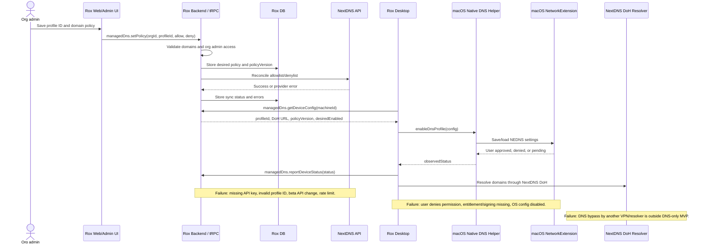

# Managed NextDNS Profile for Rox

Status: proposed
Date: 2026-06-18
Owner: TBD

## Task Reformulation

Add a Rox-managed DNS policy that stores a `NextDNSProfileID` in Rox backend,
syncs Rox allowlist/denylist changes into that NextDNS profile, and lets Rox
Desktop enable that profile as the user's system DNS on macOS.

This plan excludes Tailscale. It also excludes a strict packet/content firewall
from the MVP. The MVP uses DNS Settings, not a full Network Filter. A true
Network Filter is a later hard-enforcement phase if DNS-level policy is not
enough.

## Assumptions And Boundaries

- Rox controls one or more NextDNS profiles.
- Rox backend, not the desktop app, owns the NextDNS API key.
- Rox Desktop receives only non-secret config: profile ID, DoH URL, policy
  version, and org/device identifiers.
- The user must explicitly allow macOS to enable the DNS configuration.
- Users on unmanaged Macs can disable system DNS settings. Non-disableable
  enforcement requires MDM/supervision and is not part of this MVP.
- NextDNS allowlist/denylist are domain-level policy. They do not filter URL
  paths and do not stop every possible DNS bypass.
- No NextDNS certificate is required for basic DoH. An Apple Developer signing
  certificate, provisioning profile, and Network Extension entitlement are
  required for the native macOS integration.

## Current State

Rox Desktop is an Electron app packaged by `apps/desktop/electron-builder.ts`.
The existing macOS entitlements under `apps/desktop/src/resources/build/` cover
Electron runtime needs, audio input, and Apple Events. They do not include
Network Extension entitlements.

Rox backend already has patterns for org-scoped integrations, secret handling,
and provider sync. `packages/db/src/schema/schema.ts` contains
`integration_connections`, and `apps/api/src/env.ts` validates server-side
secrets. NextDNS is not currently represented in the integration enum, backend
routes, desktop settings UI, or native macOS runtime.

## Target State

An org admin can configure Rox Managed DNS with:

- `nextdnsProfileId`
- desired allowlist entries
- desired denylist entries
- per-org enablement state

Rox backend syncs those desired entries to NextDNS. Rox Desktop enables the
profile on macOS after user approval and reports observed status back to Rox.

Done means:

- backend persists the desired policy;
- backend can reconcile policy to NextDNS;
- desktop can enable, disable, and observe the DNS config;
- UI shows configured, pending, active, denied, failed, and disabled states;
- tests prove domain validation, sync idempotency, permission denial handling,
  and desktop status transitions.

## Sequence

## Options And Tradeoffs

### Option A: Native DNS Settings MVP

Use Apple's DNS Settings capability to configure the system resolver to the
NextDNS DoH endpoint for the org profile.

Pros:

- asks for the minimum network permission needed for DNS-level policy;
- avoids installing a bundled DNS daemon;
- keeps NextDNS API secrets server-side;
- maps cleanly to user-visible enable/disable state.

Cons:

- requires Apple Network Extension capability, signing, and packaging work;
- user can deny or later disable the DNS config on unmanaged Macs;
- DNS-only policy can be bypassed by apps that do not use system DNS.

Recommendation: use this for MVP.

### Option B: NextDNS CLI Daemon

Bundle or install the NextDNS CLI and set `nextdns config set -profile=<id>`.

Pros:

- faster local proof of concept;
- avoids writing Swift first;
- NextDNS CLI already speaks DoH and profile config.

Cons:

- needs privileged install/daemon management;
- harder to present as a first-party Rox-managed macOS feature;
- creates lifecycle/update/support risk inside the desktop app.

Use only as a temporary internal spike, not the product path.

### Option C: Full Network Filter

Build an `NEFilterDataProvider`/content-filter extension that blocks traffic
outside the policy.

Pros:

- gives stronger enforcement than DNS-only;
- can become the answer if "only these domains work" must be hard policy.

Cons:

- substantially larger native scope;
- more invasive user permission prompt;
- higher privacy/compliance burden;
- still needs careful URL/SNI/IP/direct-connect semantics.

Defer until there is evidence that DNS-only is insufficient for the target
customers.

## Recommended Path

Build Option A first: Rox-managed NextDNS profile through native macOS DNS
Settings. Keep the code shaped so Option C can be added later without changing
the backend policy model.

The permission copy in Rox can say "Managed DNS" or "Network Protection". Do
not call the MVP a full Network Filter in user-facing UI unless it actually
ships `NEFilterDataProvider`.

## Backend Changes

### Data Model

Add a dedicated managed DNS model instead of forcing NextDNS into
`integration_connections`.

Candidate files:

- `packages/db/src/schema/enums.ts`
- `packages/db/src/schema/schema.ts` or a new schema module if the repo is
  split further before implementation
- `packages/db/src/schema/types.ts`
- `packages/db/src/schema/relations.ts`

Candidate tables:

- `managed_dns_profiles`
  - `id`
  - `organization_id`
  - `provider` = `nextdns`
  - `nextdns_profile_id`
  - `desired_enabled`
  - `policy_version`
  - `last_sync_status`
  - `last_sync_error`
  - `last_synced_at`
  - `created_by_user_id`
  - timestamps
- `managed_dns_domains`
  - `id`
  - `organization_id`
  - `managed_dns_profile_id`
  - `domain`
  - `kind` = `allow` | `deny`
  - `active`
  - `source` = `manual` | `seed` | `import`
  - `last_sync_status`
  - `last_sync_error`
  - timestamps
- `managed_dns_device_statuses`
  - `organization_id`
  - `machine_id`
  - `user_id`
  - `platform`
  - `desired_enabled`
  - `observed_status`
  - `observed_profile_id`
  - `os_config_identifier`
  - `policy_version`
  - `last_seen_at`
  - `last_error`

Do not store the NextDNS API key in these tables.

### Secrets And Env

Add server-side env:

- `NEXTDNS_API_KEY` optional until the feature is enabled.

Store the real value in Infisical or the deployment secret manager. Do not send
it to desktop clients. Do not log it.

### NextDNS Client

Add a small server-only client:

- `packages/trpc/src/lib/nextdns/client.ts` or `apps/api/src/lib/nextdns/client.ts`
- validates response shape with `zod`;
- sends `X-Api-Key`;
- wraps NextDNS API errors into typed Rox errors;
- supports:
  - read profile;
  - add allowlist domain;
  - remove allowlist domain;
  - add denylist domain;
  - remove denylist domain;
  - list current allowlist/denylist for reconciliation.

NextDNS API is currently documented as beta. Keep the adapter isolated and add
contract tests with mocked responses.

### tRPC/API Surface

Add a protected admin router:

- `managedDns.getPolicy`
- `managedDns.setProfile`
- `managedDns.addDomain`
- `managedDns.removeDomain`
- `managedDns.syncNow`
- `managedDns.getDeviceConfig`
- `managedDns.reportDeviceStatus`

Access rules:

- org admins can mutate profile and domain policy;
- org members can read the device config needed by their signed-in desktop;
- desktop status reports must be scoped to the active org and machine ID.

### Reconciliation

Implement idempotent reconciliation:

1. Read desired rows from Rox DB.
2. Read current NextDNS allowlist/denylist.
3. Add missing active rows.
4. Remove rows that Rox owns and has marked inactive.
5. Persist per-domain sync status.

Do not delete unmanaged domains from the NextDNS profile until ownership
semantics are explicit. The first version should only manage rows created by
Rox or tagged in Rox state.

## Desktop Changes

### Native macOS Layer

Add a small macOS native helper or native module that can call Apple's
NetworkExtension DNS Settings APIs.

Candidate location:

- `apps/desktop/native/managed-dns/`

Candidate commands exposed to Electron main:

- `getStatus()`
- `enable({ profileId, dohUrl, displayName, policyVersion })`
- `disable()`
- `openSystemSettings()`

Packaging changes:

- add Network Extension entitlement for DNS settings;
- update `apps/desktop/src/resources/build/entitlements.mac.plist`;
- update `apps/desktop/src/resources/build/entitlements.mac.inherit.plist`;
- ensure `electron-builder.ts` signs and notarizes the helper/extension;
- add release notes to `apps/desktop/RELEASE.md`.

Phase 0 must prove a packaged `Rox.app`, not only a dev Electron process, can
enable and observe DNS settings.

### Electron Main

Add a tRPC router under desktop main:

- `networkDns.getStatus`
- `networkDns.enable`
- `networkDns.disable`
- `networkDns.refreshConfig`

Use `trpc-electron` observable patterns for any status subscription.

Candidate files:

- `apps/desktop/src/main/lib/managed-dns/*`
- `apps/desktop/src/main/lib/trpc/routers/*`
- preload types if the existing desktop tRPC surface requires them.

### Renderer UI

Add a settings section:

- `Settings -> Network -> Managed DNS` or under an existing organization/admin
  settings surface.

States:

- not configured;
- configured but not enabled on this Mac;
- waiting for macOS approval;
- active;
- permission denied;
- active but wrong profile;
- sync failed;
- disabled.

UI must clearly say that DNS-only protection is not a full traffic firewall.

## Web/Admin UI Changes

Add org-admin controls for:

- setting `NextDNSProfileID`;
- adding/removing allowlist domains;
- adding/removing denylist domains;
- viewing last sync status;
- triggering manual sync;
- viewing device installation/status rows.

Candidate locations depend on current admin surface:

- `apps/web/src/app/**/settings/**`
- `apps/admin/**` if this is intended for internal operators first.

## Documents To Change

Create or update these during implementation:

- `plans/2026-06-18-managed-nextdns-profile.md` - this plan.
- `apps/desktop/docs/MANAGED_DNS.md` - macOS permission model, user prompts,
  troubleshooting, and packaged-app verification.
- `apps/api/MANAGED_NEXTDNS.md` - env vars, NextDNS API behavior, sync runbook,
  failure modes, and operator rotation steps.
- `DEVELOPMENT.md` - local dev flags and mocked NextDNS setup.
- `apps/desktop/RELEASE.md` - signing, entitlement, notarization, and manual
  smoke steps for Managed DNS releases.

## Inputs Needed From Operator

Required for real integration testing:

- NextDNS Profile ID for the test org.
- NextDNS API key, stored in Infisical/deploy secrets as `NEXTDNS_API_KEY`.
  Do not paste it into chat.
- Decision: one shared Rox-owned profile, one profile per organization, or one
  profile per environment.
- Decision: should Rox manage only Rox-created allowlist/denylist rows, or take
  full ownership of the profile lists?
- Decision: fail-open or fail-closed UI posture when sync fails.
- Apple Developer Team ID and signing setup that can include the Network
  Extension DNS Settings entitlement.
- A macOS test machine where approving DNS settings prompts is acceptable.

Not required:

- NextDNS client certificate. Basic NextDNS DoH does not need one.

Possibly required later:

- Apple Developer ID Application certificate and provisioning profile changes
  for the native helper.
- MDM profile only if the target customers need non-disableable enforcement.
- Root CA only if a future NextDNS block-page experience requires HTTPS block
  page trust. It is not needed for DNS resolution/filtering itself.

## Tasks As State Transitions

1. Given current state has no NextDNS model and target state needs org-scoped
   managed policy, add managed DNS schema and generated migration so Rox can
   store profile, domain, and device status state.
2. Given current state has no server-side NextDNS adapter and target state needs
   Rox to own policy sync, add a typed NextDNS API client and mocked contract
   tests so API beta changes fail loudly.
3. Given current state has no admin API and target state needs controlled
   mutation, add `managedDns` tRPC procedures with org-admin write checks so
   policy changes are auditable and scoped.
4. Given current state has no macOS DNS runtime and target state needs Desktop
   enablement, build a native DNS Settings spike in packaged `Rox.app` so the
   entitlement, signing, and user approval path are proven before UI polish.
5. Given current state has no desktop status surface and target state needs
   observable install state, add Electron main tRPC procedures so the renderer
   can enable, disable, and report status without shelling secrets.
6. Given current state has no user controls and target state needs admin and
   user flows, add web/admin policy UI and desktop settings UI so admins manage
   lists and users see local permission state.
7. Given current state has no runbook and target state needs supportable
   operations, write backend and desktop Managed DNS docs so API keys,
   entitlement failures, user-denied permissions, and sync failures have
   operator steps.

## Verification Proof

Backend:

- unit tests for domain normalization and invalid-domain rejection;
- unit tests for NextDNS client error mapping;
- reconciliation test proving idempotent add/remove;
- access-control tests proving only org admins mutate policy;
- `bun run typecheck`;
- `bun run lint < /dev/null`.

Desktop:

- unit tests for status reducer and renderer states;
- native helper smoke on macOS;
- packaged `Rox.app` proof that DNS settings can be enabled and disabled;
- `scutil --dns` proof that the active resolver points at the Rox/NextDNS
  configuration;
- NextDNS logs/status proof that test domains resolve through the profile;
- denied-permission proof showing UI lands in `permission_denied`, not a silent
  failure.

Release:

- signed/notarized macOS package with Network Extension entitlement present;
- manual rollback path: disable Managed DNS from Rox and from macOS System
  Settings.

## Remaining Blockers

- Apple entitlement/signing feasibility must be proven in a packaged app.
- NextDNS API is beta, so the adapter needs tests and conservative sync logic.
- Exact UI location depends on whether Managed DNS is sold as org-admin policy,
  internal operator policy, or user-controlled desktop protection.
- Hard "only these domains can ever connect" is not proven by DNS-only. That
  requires a later content-filter phase.

## References

- Apple DNS Settings: https://developer.apple.com/documentation/networkextension/dns-settings
- Apple `NEDNSSettingsManager`: https://developer.apple.com/documentation/networkextension/nednssettingsmanager
- Apple content filter providers: https://developer.apple.com/documentation/networkextension/content-filter-providers
- Apple `NEFilterControlProvider`: https://developer.apple.com/documentation/NetworkExtension/NEFilterControlProvider
- NextDNS API: https://nextdns.github.io/api/
- NextDNS CLI configuration: https://github.com/nextdns/nextdns/wiki/Configuration
