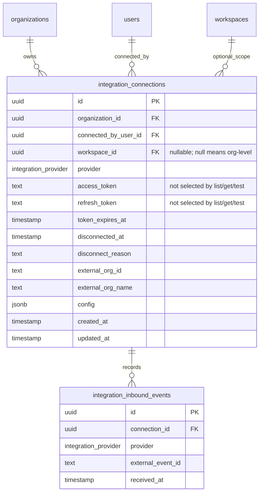
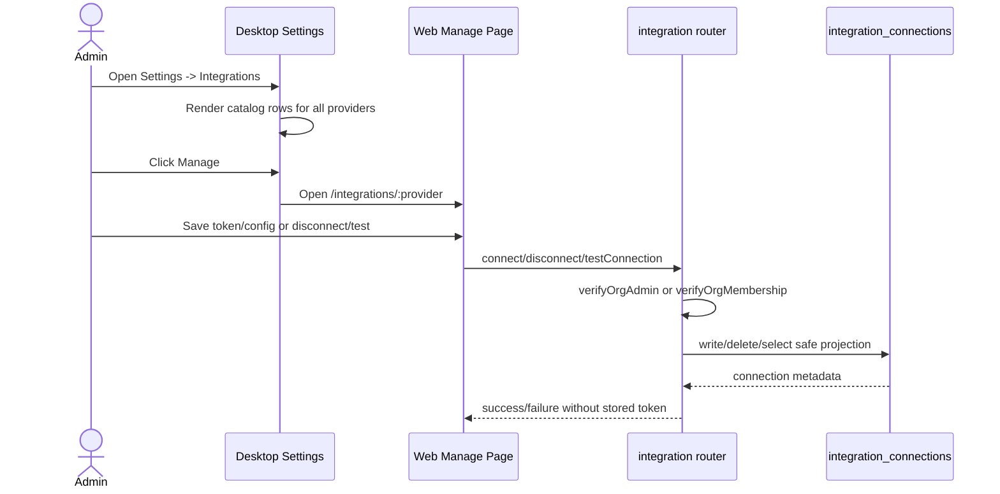
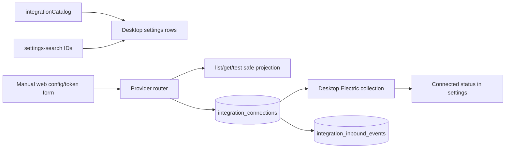

# Rox Release Train Receipt - 2026-06-16

## #32 T-HOSTS Lane - Remote Hosts and Sandboxes

### Current State

- Worktree: `.worktrees/issue-32-hosts`
- Branch: `issue/32-hosts`
- Issue: `https://github.com/agisota/rox/issues/32`
- Base at lane start: `origin/main` `b8b42aa15`
- Existing host storage already has `v2_hosts.kind`, `provider`, `port`, `protocol`, and `expiresAt`.
- Existing managed provider adapters already cover Daytona, Modal, E2B, and Rox self via `packages/host-provisioner`, and the live `v2Host.provision` path remains credential-gated by env or per-request provider keys.
- Existing settings Hosts UI already has an Add Host modal, a provider picker, local host fallback, and a host detail page, but it had no no-spend add-server path for a user-owned remote host endpoint.
- Schema gap: `v2_hosts` does not have a separate provider-returned hostname/address column. Without a DB migration, managed provider hostnames returned by `host-provisioner` cannot be persisted separately from `machineId`.

### Target State

- Users can add a self-managed remote server or sandbox endpoint without triggering paid/live provisioning.
- The add-server flow records host identity, port, protocol, provider=`self`, kind=`remote|sandbox`, owner membership, and sandbox TTL expiry when applicable.
- Daytona/Modal/E2B remain wired through the existing `v2Host.provision` path and stay credential-gated.
- Hosts detail UI displays host, protocol, port, provider, type, and sandbox expiry for non-local hosts.
- No production DB migrations, deployments, secret changes, or live provider provisioning are performed in this lane.

### Gap / Transformation

- Given that #32 needs add-server semantics but live provisioning must stay credential-gated, add `v2Host.addServer` as a separate no-spend mutation instead of overloading `v2Host.provision`.
- Given that current schema has no separate `host` column, store self-managed hostname in `machineId` for this subset and document managed-provider hostname persistence as a follow-up blocker.
- Given that sandboxes need TTL semantics where current architecture supports it, compute `expiresAt` for self-managed sandbox registrations and keep managed provider TTL in the existing provisioner path.
- Given that settings Hosts already owns the add surface, extend `AddHostModal` rather than creating a parallel screen.

### Tasks as State Transitions

- Given that we are now in a state where self-managed servers cannot be added without live provisioning, and target state is no-spend add-server registration, add `v2Host.addServer` in `packages/trpc/src/router/v2-host/v2-host.ts` so a self-managed host row and owner membership are inserted atomically.
- Given that we are now in a state where hostname/TTL normalization is inline risk, and target state is testable contract behavior, add `packages/trpc/src/router/v2-host/self-managed.ts` and focused tests so host normalization, protocol validation, and sandbox expiry are proven without DB access.
- Given that we are now in a state where the Add Host modal only provisions managed providers, and target state is a user-owned server add flow, extend `AddHostModal` with self-managed host/protocol/port/TTL inputs so the UI calls `v2Host.addServer` for provider=`self`.
- Given that we are now in a state where the detail view compresses network data into one address string, and target state is host/port/protocol visibility, update `HostConnectionSection` to display Host, Protocol, and Port separately.

### Verification Proof

- Red TDD checkpoint: `bun test packages/trpc/src/router/v2-host/self-managed.test.ts` initially failed because `./self-managed` did not exist.
- `bun test packages/trpc/src/router/v2-host/self-managed.test.ts packages/trpc/src/router/v2-host/v2-host.test.ts`: passed, 5 tests, 8 expects.
- `bun test packages/host-provisioner/src`: passed, 19 tests, 48 expects.
- `bun test apps/desktop/src/renderer/routes/_authenticated/settings/hosts/lib/localHostFallback.test.ts`: passed, 4 tests, 4 expects.
- `bun run typecheck` from `packages/trpc`: passed.
- `bun run typecheck` from `packages/host-provisioner`: passed.
- `bun run typecheck` from `apps/desktop`: passed after `generate:icons` and `generate:routes`.

### Remaining Blockers

- Managed-provider hostname persistence needs a schema change because `v2_hosts` currently has no separate `host`/address column. This lane did not edit DB schema or generate/apply migrations.
- Live Daytona/Modal/E2B provisioning was not smoke-tested against real providers because this lane must not spend money or use live provisioning credentials.
- The self-managed add-server path assumes the provided host is already running Rox host-service; health checks and remote bootstrap are follow-up work.
- #34/#35 remain untouched.

## Share/Auth/Branding Lane

- Worktree: `.worktrees/share-auth-branding`
- Branch: `issue/share-auth-branding`
- PR: `https://github.com/agisota/rox/pull/142`
- State: merged to `main`
- Base at lane verification: `origin/main` at `1c7b425a90faf2ce21922ccd819c2d25a484e6fd`

### Current State

- Share/auth/branding lane has product code for public share management, artifact share publishing from desktop settings, public share revocation, and anonymous `/s/:slug` rendering proof.
- The lane receipt traveled with PR #142 because the separate release-train receipt worktree was not present in the active checkout.

### Target State

- Public chat/artifact snapshots are shareable through `public_shares` without exposing live private resources.
- Owners can list/copy/revoke their shares; org admins can manage org public shares.
- Desktop exposes a settings surface for public links and artifact sharing.
- Anonymous visitors can open only non-revoked snapshots on `/s/:slug`.
- The lane is reviewable as a single PR with local, targeted, and browser-visible evidence.

### Gap / Transformation

- `packages/trpc` now exposes `share.listPublic` and `share.revokePublic`, with creator/admin scoping and revoked-link filtering.
- Desktop settings now has a `shares` section, settings search metadata, sidebar entry, and `SharesSettings` UI for list/copy/revoke plus artifact publish/copy actions.
- Desktop collections now include read-only org-scoped `artifacts` so the share UI can operate on existing artifact snapshots.
- Local smoke seeds one immutable `public_shares` row and verifies the public web route renders the serialized snapshot through portless.

### Share Lane Verification Proof

- `./.rox/setup.local.sh`: passed; created ignored local `.env`, started `rox-share-auth-branding` Docker DB stack, applied local migrations, seeded `admin@local.test`.
- Seeded local `public_shares` row:
  - slug: `rox-share-smoke-20260616-mqg3da8s`
  - resource type: `chat_session`
  - title: `Rox Share Smoke 2026-06-16`
- Portless route:
  - command: `PORTLESS_TLD=t portless --name rox-share-smoke --app-port 3020 bun run --cwd apps/web dev`
  - verified URL: `https://rox-share-smoke.t/s/rox-share-smoke-20260616-mqg3da8s`
  - evidence: `curl -k -sS -o /tmp/rox-share-smoke.html https://rox-share-smoke.t/s/rox-share-smoke-20260616-mqg3da8s`
  - status: `200`
  - content checks: `Rox Share Smoke 2026-06-16`, `rox-share-smoke-20260616-mqg3da8s`, `Browser-visible share smoke request`, and `Rox share smoke response visible through /s/:slug` were present in `/tmp/rox-share-smoke.html`.
  - browser-visible proof: `open https://rox-share-smoke.t/s/rox-share-smoke-20260616-mqg3da8s` exited 0 and opened the verified local portless URL in the default browser.

### Share Lane Automated Verification

- `bunx @biomejs/biome@2.4.2 check --write --unsafe <touched share files>`: passed, 13 files, no fixes.
- `bun test packages/trpc/src/router/share/share.test.ts`: passed, 11 tests, 23 expects.
- `bun test apps/desktop/src/renderer/routes/_authenticated/settings/utils/settings-search/settings-search.test.ts`: passed, 8 tests, 13 expects.
- `bun test apps/desktop/src/renderer/routes/_authenticated/settings/shares/components/SharesSettings/share-artifacts.test.ts`: passed, 3 tests, 5 expects.
- `bun run generate:routes` from `apps/desktop`: passed.
- `bun run typecheck` from `packages/trpc`: passed.
- `bun run typecheck` from `apps/web`: passed.
- `bun run typecheck` from `apps/desktop`: passed.
- `bun run lint` from repo root: passed, 5044 files, no fixes.

## Issue #27 Themes Lane

- Worktree: `.worktrees/issue-27-themes`
- Branch: `issue/27-themes`
- PR: `https://github.com/agisota/rox/pull/143`
- Base after receipt merge: `origin/main` at `b8b42aa15`
- Scope: verify the Zed-derived theme library, preserve dark/glass defaults, and lock Electron glass/vibrancy behavior with desktop tests.

### Current State

- Zed theme conversion and generated library tests already cover conversion, unique non-reserved IDs, and generated dataset color validity.
- Desktop persisted app defaults select the built-in dark theme and enable glass at `0.3` opacity.
- Electron window creation uses `getGlassWindowOptions`, but the helper had no focused unit test coverage and `main.ts` had a stale comment saying the glass toggle defaulted off.

### Target State

- Zed library import remains verified through generated-dataset tests.
- Default desktop state is explicitly verified as dark theme + glass enabled + `0.3` window opacity.
- macOS vibrancy helper behavior is verified, while non-mac platforms continue to fall back to an opaque background.

### Verification Proof

- `bun test apps/desktop/src/shared/themes/zed/convert.test.ts apps/desktop/src/shared/themes/zed/base16.test.ts`: 10 pass, 2795 expects.
- `bun test apps/desktop/src/main/lib/app-state/schemas.test.ts apps/desktop/src/main/lib/glass-window.test.ts`: 7 pass, 12 expects.
- `bun run --cwd apps/desktop typecheck`: passed after `generate:icons` and `generate:routes`.
- `bun run lint`: passed, checked 5047 files with no fixes after merging current `origin/main`.

## Remaining Blockers

- #28, #29, #30, and #32 still require their own lane receipts and PRs.
- #34/#35 remain gated until billing interfaces stabilize.
- Full desktop app visual vibrancy smoke is still a final release-train gate, not claimed by #27.
- Full monorepo `bun test` / `bun run build` are reserved for the final integration train gate after all lane PRs settle.
- Local DB migrations for share smoke were applied only to the per-worktree Docker database. No production database or remote deployment was touched.

## #30 T-INTEGR Lane - Current State

- Worktree: `.worktrees/issue-30-integrations`
- Branch: `issue/30-integrations`
- Base at start: `origin/main` `b8b42aa15`
- Existing schema state: `integration_provider` already includes `linear`, `github`, `slack`, `telegram`, `discord`, `notion`, `obsidian`, `fibery`, and `lark`; `integration_connections` stores org/workspace provider records; `integration_inbound_events` stores provider webhook/event idempotency rows.
- Existing router state: Linear and GitHub had provider-specific management/test coverage; Telegram, Discord, Notion, Obsidian, Fibery, and Lark used the shared provider connection router for manual connect/disconnect/getConnection; Slack has an existing web OAuth management page with disconnect.
- Existing settings state: desktop settings rendered only Linear and GitHub, while the shared integration catalog and web catalog already listed all nine providers. Web manual management existed for Telegram, Obsidian, Fibery, and Lark, but not Discord or Notion.

## #30 T-INTEGR Lane - Target State

- Telegram, Discord, Slack, Linear, GitHub, Notion, Obsidian, Fibery, and Lark are visible from desktop Settings -> Integrations and searchable by provider name.
- Each desktop row has a management route. GitHub/Linear/Slack continue to use existing web management pages; manual providers use token/config forms without live external OAuth requirements.
- Shared manual provider router supports a local test/validation action that verifies stored connection presence without calling external provider APIs or returning stored tokens.
- No production secrets, production DB, deploys, #34/#35 work, or unrelated refactors.

## #30 T-INTEGR Lane - ERD / Schema View

- Keys/indexing assumptions: org-level uniqueness is enforced by `(organization_id, provider) WHERE workspace_id IS NULL`; workspace-scoped uniqueness by `(organization_id, provider, workspace_id) WHERE workspace_id IS NOT NULL`; inbound events dedupe on `(provider, external_event_id)`.
- Token storage boundary: this lane did not add a new secret table or encryption migration. It hardened only the existing read path by keeping list/get/test projections token-free.

## #30 T-INTEGR Lane - Sequence View

- Failure points: missing org membership, non-admin connect/disconnect, new manual connection without token, missing connection on test/disconnect, external OAuth provider pages not implemented for true live provider auth.

## #30 T-INTEGR Lane - Data Flow

- Checkpoints: desktop visibility comes from `integrationCatalog`; discoverability comes from `settings-search`; token input is accepted only on web manual forms; persisted status comes back through safe metadata projections.

## #30 T-INTEGR Lane - Gap / Transformation

- Given current desktop settings only rendered Linear/GitHub and target is nine visible providers, desktop settings now maps the shared integration catalog into settings rows and renders every provider with a manage link.
- Given search only knew Linear/GitHub and target is provider-name discoverability, settings search now has IDs, variant entries, keywords, and tests for all nine providers.
- Given Discord/Notion router support existed but web management pages rejected those provider IDs, the dynamic manual integration page and controls now support Discord/Notion token/config forms.
- Given manual provider routers had connect/disconnect/getConnection but no safe validation action, the shared provider router now exposes `testConnection`, which checks only stored connection presence and returns no token fields.

## #30 T-INTEGR Lane - Verification Proof

- `bun test packages/trpc/src/router/integration/shared/provider-router.test.ts packages/trpc/src/router/integration/linear/linear.test.ts packages/trpc/src/router/integration/github/github.test.ts`: passed, 30 tests, 51 expects.
- `bun test apps/desktop/src/renderer/routes/_authenticated/settings/utils/settings-search/settings-search.test.ts apps/desktop/src/renderer/routes/_authenticated/settings/integrations/components/IntegrationsSettings/integration-settings-model.test.ts`: passed, 12 tests, 41 expects.
- `bun run --cwd packages/trpc typecheck`: passed.
- `bun run --cwd apps/web typecheck`: passed.
- `bun run --cwd apps/desktop typecheck`: passed after `generate:icons` and `generate:routes`.
- `bun run lint`: passed, 5048 files, no fixes.

## #30 T-INTEGR Lane - Remaining Blockers

- This lane intentionally does not implement live external OAuth or provider API validation for Telegram, Discord, Notion, Obsidian, Fibery, or Lark; `testConnection` is local stored-connection validation only.
- Slack remains managed by the existing web Slack OAuth page; this lane does not add manual Slack token storage or alter Slack OAuth behavior.
- No production DB migration/application, production secret rotation, deployment, full `bun test`, or full build was run in this lane.
