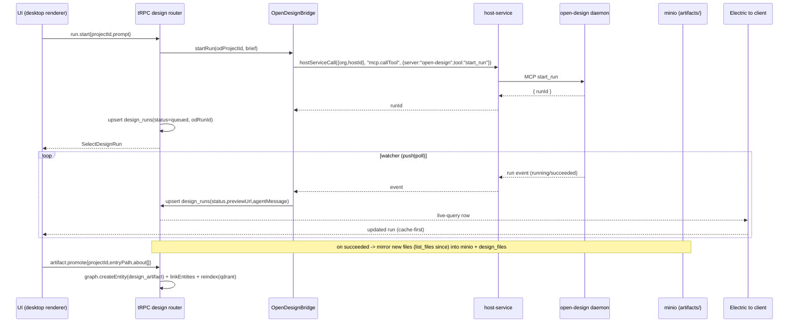

# 15 — Design-воркспейс (Open Design): L3 implementation-ready ТЗ

> Ссылка на общий контракт: `plans/superapp-l3-specs/00-shared-context.md` (§2 ядро графа — НЕ переопределять; §3 конвенции; §4 допущения; §5 шаблон). Углублённый дизайн: `plans/rox-superapp-roadmap-and-design.md` (Фаза 5, §2A/2C/2D/2E).

## 0. Резюме и границы

**Что это.** Встроенный в Rox дизайн-воркспейс «Open Design»: пользователь (или агент) создаёт **дизайн-проекты**, внутри них **файлы** (HTML/JSX/CSS/SVG/токены/ассеты) и **артефакты** (entry-файл + `ArtifactManifest`), запускает **run'ы генерации/рефайнмента** (агент Open Design делает работу), просматривает результат в изолированном sandbox-iframe и **промоутит** артефакт в граф (узел `design_artifact`), связывая его с заметками/задачами/чатами/проектами.

**Фаза:** 5 (граф-приложения и дизайн). **Зависит от:** #1 (ядро графа: `entities`/`edges`/graph-сервис) и #2 (рантайм: minio для бинарей, qdrant для семантического поиска, Electric для cache-first sync). Опционально пересекается с canvas Фазы 1/5 (artifact-preview как нода), но canvas-движок — вне этой спеки.

**Что входит (in scope):**
- Detail-таблицы `design_projects`, `design_files`, `design_artifacts`, `design_runs` (1:1/1:N к `entityId`).
- tRPC-роутер `design` (новый): CRUD проектов/файлов/артефактов, run lifecycle, промоут в граф, поиск.
- Мост к **локальному MCP-демону `open-design`** через `host-service` (демон уже даёт модель проектов/файлов/артефактов/run'ов — переиспользуем, A7), с зеркалированием метаданных в Postgres и бинарей в minio.
- Sandbox-исполнение артефактов (изолированный iframe + worker, строгий CSP).
- UI feature-модуль `design` (lazy): список проектов, файловое дерево, редактор/превью, run-консоль, диалог промоута.
- Маппинг артефактов на qdrant для семантического поиска по дизайнам.

**Что НЕ входит (out of scope):**
- Сам node-graph/spatial canvas движок (tldraw/React Flow) — Фаза 1/5, отдельная спека; здесь только контракт «artifact как нода» (раздел 4).
- Полноценный визуальный WYSIWYG-редактор макетов (drag-resize-канвас). MVP — кодовый редактор + live-preview + AI-run.
- Деплой артефактов на внешний хостинг (Vercel и т.п.).
- Реализация самого `open-design` демона (внешний продукт; мы потребитель его MCP-интерфейса).
- Биллинг/экономика run'ов сверх записи `costRox`/`usdCost` (метрика идёт в существующую `economy`/`usage_requests` — раздел 3).

**Принятые допущения (00-shared-context §4; ревизируемо):**
- **A7** (основная): Design = встроенный Open Design; артефакты (JSX/HTML/CSS) хранятся как `file` в minio, узел `design_artifact`; sandbox исполнения — изолированный iframe/worker; модель проектов/файлов/артефактов/run'ов берётся из MCP `open-design`.
- **A8**: minio bucket на org `org-<orgId>`, префикс домена `artifacts/` (+ `exports/` для экспортов); `storageRef = {bucket,key,mime,size}`.
- **A3** (косвенно): realtime run-статусов — через Electric live-query на `design_runs` (а не новый стек); прогресс из демона прокидывается через `host-service` event-stream → upsert строки run → Electric вниз.
- **Локальная развилка L15-1 (ревизируемо):** источник истины контента файла — **minio** (Postgres хранит только `storageRef`+метаданные, не сам blob), кроме мелкого entry-исходника артефакта, который дублируется в `design_artifacts.entrySource` text для поиска/диффа (зеркалит A2 «markdown производный для поиска»).
- **Локальная развилка L15-2 (ревизируемо):** один `open-design` демон привязан к одному хосту (машине пользователя) через `host-service`; маппинг `design_projects.hostId → v2Hosts.id` (реальная таблица хостов — `v2Hosts`, `packages/db/src/schema/schema.ts:543`; список доступных хостов тянется из существующего `v2-host`-роутера на `v2Hosts`/`v2UsersHosts`). Облачный (headless) режим демона — открытый вопрос (раздел 9).

---

## 1. Доменная модель (полная схема БД)

Файл: **`packages/db/src/schema/design.ts`** (новый). Зеркалит `knowledge.ts`/`agent.ts`: org-scoped cascade FK, `uuid().primaryKey().defaultRandom()` для собственных PK / `entityId` PK для detail 1:1, jsonb-тела с `$type<>`, lifecycle-`status` enum, `created_at`/`updated_at` c `$onUpdate`, enums из `enums.ts`, типы через `$inferInsert`/`$inferSelect`.

### 1.1 Новые enum-значения (diff к §2.1)

`design_artifact` уже присутствует в `entityKindValues` ядра — **новых kind не добавляем**. Из `edgeRelationValues` переиспользуем `derived_from`, `attached_to`, `about`, `references`, `embeds`, `tagged_with`, `child_of`, `authored_by` — **новых relation не добавляем** (промоут артефакта = `derived_from`/`about`, см. §2). Добавляем только доменные enum'ы (НЕ пересекаются с существующим `artifactKindValues` из `workflow.ts`):

```ts
// enums.ts — ДОБАВИТЬ (diff). Существующие значения ядра §2.1 НЕ трогаем.
export const designProjectStatusValues = ["active", "archived", "trashed"] as const;
export const designFileKindValues = [
  "html", "jsx", "tsx", "css", "tokens", "svg", "markdown", "image", "asset", "other",
] as const;
export const designArtifactKindValues = ["html", "jsx", "svg", "markdown"] as const; // entry-тип Open Design
export const designRunStatusValues = ["queued", "running", "succeeded", "failed", "canceled"] as const; // 1:1 со статусами get_run MCP
export const designRunDriverValues = ["prompt", "skill", "plugin"] as const;       // start_run: prompt | skill | plugin
```

```ts
// enums.ts — соответствующие pgEnum + zod (рядом с knowledgeDocumentType)
export const designProjectStatus = pgEnum("design_project_status", designProjectStatusValues);
export const designFileKind = pgEnum("design_file_kind", designFileKindValues);
export const designArtifactKind = pgEnum("design_artifact_kind", designArtifactKindValues);
export const designRunStatus = pgEnum("design_run_status", designRunStatusValues);
export const designRunDriver = pgEnum("design_run_driver", designRunDriverValues);

export const designRunStatusEnum = z.enum(designRunStatusValues);
export type DesignRunStatus = z.infer<typeof designRunStatusEnum>;
export const designFileKindEnum = z.enum(designFileKindValues);
export type DesignFileKind = z.infer<typeof designFileKindEnum>;
export const designArtifactKindEnum = z.enum(designArtifactKindValues);
export type DesignArtifactKind = z.infer<typeof designArtifactKindEnum>;
```

### 1.2 `design_projects` — рабочая область (ленивый 1:1 к `entities`)

Узел графа создаётся только для **промоутнутого артефакта** (см. §2). Проект — рабочая область со своим PK `id`; чтобы не плодить узлы, у проекта есть опциональный `entityId` (заполняется лениво при первом промоуте/привязке проекта к графу). Это гибкая форма «detail 1:1 к entityId»: связь возникает лениво.

**Импорт-блок ниже относится ко ВСЕМУ модулю `design.ts` (все 4 таблицы §1.2–1.5), а не только к `design_projects`.** Фрагменты §1.2–1.5 — части одного файла; собирать импорты в начале файла одним блоком, чтобы не было unused-import (Biome падает на warning, AGENTS.md §7). После генерации запустить `bun run lint:fix` и убедиться, что `bun run lint` не выдаёт unused-import (все enum'ы `designProjectStatus`/`designFileKind`/`designArtifactKind`/`designRunStatus`/`designRunDriver` и все drizzle-core импорты `index/integer/boolean/numeric/uniqueIndex/foreignKey` реально используются таблицами §1.2–1.5).

```ts
import {
  boolean, foreignKey, index, integer, jsonb, numeric, pgTable, text, timestamp, uniqueIndex, uuid,
} from "drizzle-orm/pg-core";
import { sql } from "drizzle-orm";
import { organizations, users } from "./auth";
import { v2Projects, v2Hosts } from "./schema"; // v2Hosts — реальная таблица хостов (schema.ts:543), НЕ мифический `hosts`
import { entities } from "./entity";          // ядро (#1)
import {
  designProjectStatus, designFileKind, designArtifactKind, designRunStatus, designRunDriver,
} from "./enums";
// Тип провенанса берём из канонического @rox/shared/knowledge (packages/shared/src/knowledge/types.ts),
// а НЕ из ./knowledge: legacy-таблица knowledge.ts депрекейтится и удаляется миграцией #03
// (drop_legacy_knowledge, 03-pkm §5). Так как #15 — Фаза 5 (после Фазы 1), импорт из ./knowledge
// сломал бы компиляцию design.ts. (01-core-graph §1.2.0: канон провенанса — _shared.ts/EntitySourceRef,
// его реэкспорт-алиас — KnowledgeSourceRef.)
import type { KnowledgeSourceRef } from "@rox/shared/knowledge";

export type DesignStorageRef = { bucket: string; key: string; mime?: string; size?: number };

export const designProjects = pgTable(
  "design_projects",
  {
    id: uuid().primaryKey().defaultRandom(),
    organizationId: uuid("organization_id").notNull()
      .references(() => organizations.id, { onDelete: "cascade" }),
    v2ProjectId: uuid("v2_project_id").references(() => v2Projects.id, { onDelete: "set null" }),
    // Узел графа появляется лениво (при promote проекта). Обычно null.
    entityId: uuid("entity_id").references(() => entities.id, { onDelete: "set null" }),
    // Машина, на которой живёт open-design демон (L15-2). FK на реальную таблицу хостов v2Hosts.
    hostId: uuid("host_id").references(() => v2Hosts.id, { onDelete: "set null" }),
    // Идентификатор проекта внутри демона (create_project возвращает id-слаг).
    odProjectId: text("od_project_id"),
    slug: text().notNull(),                 // org-уникальный slug
    name: text().notNull(),
    entryFile: text("entry_file"),          // metadata.entryFile демона (напр. "index.html")
    designSystemId: text("design_system_id"),
    status: designProjectStatus().notNull().default("active"),
    // Провенанс (какой чат/run создал проект) — переиспользуем тип ядра.
    sourceRef: jsonb("source_ref").$type<KnowledgeSourceRef>(),
    metadata: jsonb().$type<Record<string, unknown>>().notNull().default({}),
    // Идемпотентность project.create (раздел 2): повтор с тем же ключом → возврат существующей строки.
    idempotencyKey: text("idempotency_key"),
    createdByUserId: uuid("created_by_user_id").references(() => users.id, { onDelete: "set null" }),
    createdAt: timestamp("created_at", { withTimezone: true }).notNull().defaultNow(),
    updatedAt: timestamp("updated_at", { withTimezone: true }).notNull().defaultNow().$onUpdate(() => new Date()),
  },
  (t) => [
    index("design_projects_org_idx").on(t.organizationId),
    index("design_projects_project_idx").on(t.v2ProjectId),
    index("design_projects_status_idx").on(t.status),
    index("design_projects_host_idx").on(t.hostId),
    uniqueIndex("design_projects_org_slug_uniq").on(t.organizationId, t.slug),
    // Идемпотентность project.create (partial unique, как design_runs_idem_uniq).
    uniqueIndex("design_projects_org_idem_uniq").on(t.organizationId, t.idempotencyKey)
      .where(sql`${t.idempotencyKey} IS NOT NULL`),
    // Один Rox-проект ↔ один проект демона на хосте.
    uniqueIndex("design_projects_host_od_uniq").on(t.hostId, t.odProjectId)
      .where(sql`${t.odProjectId} IS NOT NULL`),
  ],
);
export type InsertDesignProject = typeof designProjects.$inferInsert;
export type SelectDesignProject = typeof designProjects.$inferSelect;
```

### 1.3 `design_files` — N:1 к проекту (метаданные + storageRef в minio)

```ts
export const designFiles = pgTable(
  "design_files",
  {
    id: uuid().primaryKey().defaultRandom(),
    organizationId: uuid("organization_id").notNull()
      .references(() => organizations.id, { onDelete: "cascade" }),
    designProjectId: uuid("design_project_id").notNull()
      .references(() => designProjects.id, { onDelete: "cascade" }),
    path: text().notNull(),                 // путь относительно корня проекта ("components/Hero.tsx")
    kind: designFileKind().notNull().default("other"),
    mime: text(),
    size: integer().notNull().default(0),
    // Источник истины контента = minio (L15-1). storageRef обязателен.
    storageRef: jsonb("storage_ref").$type<DesignStorageRef>().notNull(),
    // sha256 контента для дедупликации/детекта изменений (since-poll демона).
    contentHash: text("content_hash"),
    // Признак entry-файла артефакта (есть ArtifactManifest).
    isEntry: boolean("is_entry").notNull().default(false),
    mtimeMs: integer("mtime_ms"),           // mtime из list_files (since-poll)
    createdAt: timestamp("created_at", { withTimezone: true }).notNull().defaultNow(),
    updatedAt: timestamp("updated_at", { withTimezone: true }).notNull().defaultNow().$onUpdate(() => new Date()),
  },
  (t) => [
    index("design_files_org_idx").on(t.organizationId),
    index("design_files_project_idx").on(t.designProjectId),
    index("design_files_kind_idx").on(t.kind),
    uniqueIndex("design_files_project_path_uniq").on(t.designProjectId, t.path),
  ],
);
export type InsertDesignFile = typeof designFiles.$inferInsert;
export type SelectDesignFile = typeof designFiles.$inferSelect;
```

### 1.4 `design_artifacts` — строго 1:1 к `entities` (kind=`design_artifact`)

Промоутнутый артефакт — узел графа. Detail-таблица строго 1:1 к `entityId` (PK = `entityId`, как `tasks` в §2A).

```ts
export const designArtifacts = pgTable(
  "design_artifacts",
  {
    entityId: uuid("entity_id").primaryKey()
      .references(() => entities.id, { onDelete: "cascade" }),
    organizationId: uuid("organization_id").notNull()
      .references(() => organizations.id, { onDelete: "cascade" }),
    designProjectId: uuid("design_project_id").notNull()
      .references(() => designProjects.id, { onDelete: "cascade" }),
    // Entry-файл артефакта внутри проекта.
    entryFileId: uuid("entry_file_id").references(() => designFiles.id, { onDelete: "set null" }),
    entryPath: text("entry_path").notNull(),      // "index.html" / "deck.html"
    kind: designArtifactKind().notNull().default("html"),
    // ArtifactManifest (sidecar демона) — типобезопасный jsonb.
    manifest: jsonb().$type<ArtifactManifest>(),
    // Мелкий entry-исходник дублируется для поиска/диффа (L15-1). Крупные ассеты — только в minio.
    entrySource: text("entry_source"),
    // Снимок превью (PNG в minio) для карточки/качества поиска.
    previewRef: jsonb("preview_ref").$type<DesignStorageRef>(),
    // Версионирование: последний succeeded run, породивший этот артефакт.
    // Прямой DB-FK: граф ацикличен (design_runs.designProjectId→design_projects,
    // design_artifacts.lastRunId→design_runs), drizzle-kit это переварит. ВАЖНО: design_runs
    // должна быть объявлена в файле ВЫШЕ design_artifacts (порядок объявления §1.5 перед §1.4
    // в итоговом design.ts), либо используйте foreignKey() в callback-индексов (см. ниже).
    lastRunId: uuid("last_run_id").references(() => designRuns.id, { onDelete: "set null" }),
    version: integer().notNull().default(1),
    createdAt: timestamp("created_at", { withTimezone: true }).notNull().defaultNow(),
    updatedAt: timestamp("updated_at", { withTimezone: true }).notNull().defaultNow().$onUpdate(() => new Date()),
  },
  (t) => [
    index("design_artifacts_org_idx").on(t.organizationId),
    index("design_artifacts_project_idx").on(t.designProjectId),
    index("design_artifacts_kind_idx").on(t.kind),
  ],
);
export type InsertDesignArtifact = typeof designArtifacts.$inferInsert;
export type SelectDesignArtifact = typeof designArtifacts.$inferSelect;

// ArtifactManifest — структура sidecar Open Design (минимально-достаточная типизация).
export type ArtifactManifest = {
  entry?: string;
  title?: string;
  description?: string;
  runtime?: "html" | "jsx" | "svg" | "markdown";
  dependencies?: { import: string; from: string }[];
  assets?: string[];
} & Record<string, unknown>;
```

### 1.5 `design_runs` — N:1 к проекту (lifecycle генерации)

Деньги/стоимость — `numeric(precision,scale)` (как `economy.usage_requests.usdCost`/`roxCost`), НЕ float. Время — UTC. (`numeric` уже импортирован в едином импорт-блоке §1.2 — отдельного импорта здесь не нужно.)

```ts
export const designRuns = pgTable(
  "design_runs",
  {
    id: uuid().primaryKey().defaultRandom(),
    organizationId: uuid("organization_id").notNull()
      .references(() => organizations.id, { onDelete: "cascade" }),
    designProjectId: uuid("design_project_id").notNull()
      .references(() => designProjects.id, { onDelete: "cascade" }),
    // runId, возвращённый start_run демона.
    odRunId: text("od_run_id"),
    status: designRunStatus().notNull().default("queued"),
    driver: designRunDriver().notNull().default("prompt"),
    agent: text(),                          // "claude" | "codex" | "gemini" (start_run.agent)
    model: text(),                          // override модели
    prompt: text(),                         // бриф (driver=prompt)
    skillId: text("skill_id"),              // driver=skill
    pluginId: text("plugin_id"),            // driver=plugin
    inputs: jsonb().$type<Record<string, unknown>>().notNull().default({}),
    // Текстовый вывод внутреннего агента (agentMessage из get_run) — для clarifying-вопросов.
    agentMessage: text("agent_message"),
    previewUrl: text("preview_url"),        // get_run.previewUrl (succeeded)
    error: jsonb().$type<{ code?: string; message?: string }>(),
    // Стоимость run (через numeric, как economy). Заполняется по завершении.
    usdCost: numeric("usd_cost", { precision: 20, scale: 6 }),
    roxCost: numeric("rox_cost", { precision: 20, scale: 6 }),
    // Идемпотентность start (раздел 2).
    idempotencyKey: text("idempotency_key"),
    requestedByUserId: uuid("requested_by_user_id").references(() => users.id, { onDelete: "set null" }),
    startedAt: timestamp("started_at", { withTimezone: true }),
    finishedAt: timestamp("finished_at", { withTimezone: true }),
    createdAt: timestamp("created_at", { withTimezone: true }).notNull().defaultNow(),
    updatedAt: timestamp("updated_at", { withTimezone: true }).notNull().defaultNow().$onUpdate(() => new Date()),
  },
  (t) => [
    index("design_runs_org_idx").on(t.organizationId),
    index("design_runs_project_idx").on(t.designProjectId),
    index("design_runs_status_idx").on(t.status),
    uniqueIndex("design_runs_od_run_uniq").on(t.odRunId).where(sql`${t.odRunId} IS NOT NULL`),
    uniqueIndex("design_runs_idem_uniq").on(t.organizationId, t.idempotencyKey)
      .where(sql`${t.idempotencyKey} IS NOT NULL`),
  ],
);
export type InsertDesignRun = typeof designRuns.$inferInsert;
export type SelectDesignRun = typeof designRuns.$inferSelect;
```

**FK `design_artifacts.lastRunId → design_runs.id` — это РЕАЛЬНЫЙ DB-констрейнт, а НЕ `relations.ts`.** Уточнение: drizzle `relations()` (`packages/db/src/schema/relations.ts`) создаёт только query-level связи (`one()/many()` с `references:` ВНУТРИ relations-объекта) и НЕ эмитит SQL FK-констрейнт. Поэтому ссылочная целостность достигается одним из двух способов в самой таблице:
- **(а) выбранный вариант** — `.references(() => designRuns.id, { onDelete: "set null" })` прямо в колонке `lastRunId` (см. §1.4). Граф ацикличен, drizzle-kit генерирует корректный `ALTER TABLE ... ADD CONSTRAINT`. Требует, чтобы `designRuns` была объявлена в `design.ts` ВЫШЕ `designArtifacts`.
- **(б) альтернатива при разрыве цикла** (если порядок объявления не выдержать) — объявить колонку как простой `uuid("last_run_id")` и навесить FK в callback-индексов таблицы через хелпер `foreignKey({ columns: [t.lastRunId], foreignColumns: [designRuns.id], name: "design_artifacts_last_run_id_fk" }).onDelete("set null")` — ровно так, как `foreignKey()` используется в `schema.ts:637` и `workflow.ts:504/546`. Это тоже настоящий DB-FK, в отличие от `relations.ts`.

В обоих случаях query-связь дублируется в `relations.ts` (раздел 5, шаг 3) для удобства Drizzle-Query, но ссылочная целостность держится констрейнтом выше, не relations.

### 1.6 Использование ядра графа

- **kind (из §2.1):** `design_artifact` для промоутнутого артефакта. Проект/файлы/run — НЕ узлы (живут в detail-таблицах), кроме ленивого `design_projects.entityId`.
- **relation (из §2.1):** при промоуте артефакта graph-сервис создаёт `edges`:
  - `design_artifact --derived_from--> <project-as-entity | chat session | note>` (откуда родился);
  - `design_artifact --about--> <target entity>` (привязка к задаче/заметке/проекту из диалога промоута);
  - `design_artifact --references--> <другой artifact>` (зависимости/ремиксы);
  - `design_artifact --tagged_with--> <tag entity>`.
- **identity_links / activity_events:** N/A напрямую (генерация артефакта не порождает activity_event; timeline владеет capture #8). Опционально run может писать `activity_event(kind="session", sourceEntityId=artifact)` — вне MVP.

### 1.7 Маппинг на qdrant

Индексируется **только промоутнутый `design_artifact`** (рабочие файлы/run — нет). Единая коллекция ядра (#2), point per entity:
- **payload:** `{ entityId, kind: "design_artifact", orgId, designProjectId, artifactKind, tags?: string[] }`.
- **embed-текст:** `title` + `manifest.description` + `manifest.title` + извлечённый видимый текст из `entrySource` + список имён компонентов. Реиндекс по `design_artifacts.updatedAt` (тот же воркер реиндекса ядра по `updated_at`).
- **Extractor видимого текста (фиксированный алгоритм, без додумывания):**
  - **HTML** (`kind=html`): парсинг через `parse5` (уже допустимо как dev-light dep; альтернатива `htmlparser2`) → обход DOM, собираем только текстовые ноды (`#text`) + значения атрибутов `alt`/`title`/`aria-label`; пропускаем содержимое `<script>`/`<style>` целиком.
  - **JSX/TSX** (`kind=jsx`): парсинг через `@babel/parser` (`plugins: ["jsx","typescript"]`) → обход AST, собираем `JSXText`-ноды + строковые литералы в JSX-атрибутах `title`/`alt`/`aria-label`/`placeholder` (`StringLiteral` внутри `JSXAttribute`); имена компонентов — из `JSXOpeningElement.name`. НЕ индексируем: код-выражения `{expr}` (JSXExpressionContainer пропускаем, кроме строковых литералов), import-пути, имена переменных/функций, CSS.
  - **SVG/markdown** (`kind=svg|markdown`): markdown — как plain-text (strip разметки regex-ом); svg — `<text>`/`<title>`/`<desc>` через `parse5`.
  - Ограничение размера: вход усечь до ~32 KB `entrySource`, выходной embed-текст — до ~8 KB (избегаем индексации крупных дампов). Парсер-ошибка → fallback на `title`+`manifest.*` без падения реиндекса.
- Реиндекс-хук вызывается из `design.artifact.promote` и `design.artifact.update` (раздел 2).

---

## 2. API-контракты (tRPC)

**Новый роутер `design`**: `packages/trpc/src/router/design/` (`index.ts` barrel → `design.ts`; под-файлы `projects.ts`, `files.ts`, `artifacts.ts`, `runs.ts`). Регистрируется в корневом `appRouter`. Все процедуры — `protectedProcedure`, org-scoped (фильтр по `ctx.session` → `organizationId`); запись/побочки → проверка членства в org. Вход валидируется Zod на границе. Мост к демону — через сервис `OpenDesignBridge` (раздел 3), НЕ напрямую из процедуры.

Граф-интеграция: процедуры НЕ пишут `entities`/`edges` напрямую — используют **graph-сервис ядра** (подсистема #1). **Контракт потребления graph-сервиса (определяется в `01-core-graph.md` §2.6; путь-экспорт согласуется с #1 при мерже; если сигнатуры разойдутся — адаптировать вызовы здесь).** Ожидаемая форма сервис-функций (а НЕ выдуманный путь `@rox/trpc/lib/graph` — папки `packages/trpc/src/lib/graph` на момент написания НЕТ; #1 владеет реализацией):

```ts
// Предполагаемый контракт graph-сервиса ядра (#1, 01-core-graph.md §2.6). Путь импорта —
// тот, что зафиксирует #1 (напр. packages/trpc/src/lib/graph/index.ts). РЕВИЗИРУЕМО.
createEntity(ctx, input: {
  kind: EntityKind; title: string; slug?: string;
  sourceRef?: KnowledgeSourceRef; storageRef?: StorageRef; status?: EntityStatus;
}): Promise<{ entityId: string }>;
linkEntities(ctx, input: {
  sourceEntityId: string; relation: EdgeRelation;
  targetEntityId?: string; targetSlug?: string;   // один из target* обязателен
  metadata?: Record<string, unknown>;
}): Promise<{ edgeId: string }>;                    // upsert по edges_source_target_relation_uniq
updateEntity(ctx, input: { entityId: string; title?: string; body?: Record<string, unknown>; status?: EntityStatus }): Promise<void>;
reindexEntity(ctx, entityId: string): Promise<void>; // ставит задачу в qdrant-reindex-воркер ядра (#2)
search(ctx, input: { query: string; kinds?: EntityKind[]; limit?: number }): Promise<{ entityId: string; score: number }[]>;
```

Это правило §2.6/§3: запись узла/связей/реиндекс — только через эти функции, не дублируя SQL в `design`-роутере. Если фактические сигнатуры #1 отличаются (напр. `linkEntities` адресует target иначе) — `design`-роутер адаптирует вызовы, контракт схемы при этом не меняется.

Идемпотентность: все POST-с-побочкой (`project.create`, `run.start`, `artifact.promote`) принимают опциональный `idempotencyKey`; повтор с тем же ключом в рамках org возвращает существующую строку (partial uniqueIndex `*_idem_uniq` — для `project.create` это `design_projects_org_idem_uniq` по `idempotencyKey`, колонка добавлена в §1.2). **Разграничение для `project.create`:** (1) повтор с тем же `idempotencyKey` → возврат той же строки (НЕ ошибка); (2) повтор БЕЗ ключа, но с тем же `slug` → `CONFLICT` по `design_projects_org_slug_uniq` (slug org-уникален). Это два разных механизма; они не противоречат (см. AC3 — про slug-конфликт без ключа).

Коды ошибок (ТОЛЬКО канонические tRPC-коды; `FAILED_PRECONDITION` — это gRPC-код, в `TRPCError` его НЕТ, поэтому НЕ используется): `BAD_REQUEST` (валидация/конфликт slug/путь вне корня), `NOT_FOUND` (нет проекта/файла/run в org), `FORBIDDEN` (чужая org при явной ссылке), `CONFLICT` (idempotency-гонка / run уже терминальный), `PRECONDITION_FAILED` (демон/host недоступен для генерации **И** промоут без entry — различаются по `error.cause.code` в payload: `"daemon_unavailable"` vs `"entry_missing"`), `TOO_MANY_REQUESTS` (rate-limit run'ов, + `Retry-After`), `INTERNAL_SERVER_ERROR` (сбой моста/minio). Различие «нет entry» vs «демон оффлайн» передаётся через `error.cause.code`/`error.data`, НЕ через несуществующий tRPC-код.

### 2.1 Проекты

| Процедура | Тип | Zod input | Zod output | Правила/ошибки |
|---|---|---|---|---|
| `project.list` | query | `{ status?: enum(active,archived,trashed), v2ProjectId?: uuid, cursor?: uuid, limit?: int(1..100).default(50) }` | `{ items: SelectDesignProject[], nextCursor?: uuid }` | org-scoped; cache-first на клиенте. |
| `project.get` | query | `{ id: uuid }` | `SelectDesignProject & { fileCount: int, lastRun?: SelectDesignRun }` | `NOT_FOUND` если не в org. |
| `project.create` | mutation | `{ name: str(1..200), slug?: kebab(2..80), v2ProjectId?: uuid, designSystemId?: str, hostId?: uuid, idempotencyKey?: str }` | `SelectDesignProject` | slug автогенерится из name, org-уникален (`CONFLICT` при коллизии). Вызывает `bridge.createProject` → пишет `odProjectId`. Если демон недоступен — создаёт строку `status=active`, `odProjectId=null`, `metadata.pendingDaemonSync=true` (без ошибки; генерация гейтится в UI). |
| `project.rename` | mutation | `{ id: uuid, name: str(1..200) }` | `SelectDesignProject` | `NOT_FOUND`. |
| `project.archive` | mutation | `{ id: uuid, status: enum(archived,trashed) }` | `SelectDesignProject` | soft-delete через `status` (НЕ физический DELETE). |
| `project.delete` | mutation | `{ id: uuid, confirm: literal(true) }` | `{ ok: true }` | требует `confirm:true` (зеркалит `delete_project(confirm:true)` демона). Каскад: detail-строки → CASCADE; minio-ключи под префиксом проекта удаляются best-effort. `BAD_REQUEST` без confirm. |
| `project.promote` | mutation | `{ id: uuid }` | `{ entityId: uuid }` | лениво создаёт `entities(kind=design_artifact)` для контейнера-проекта и пишет `design_projects.entityId`. Идемпотентно (повтор → тот же `entityId`). |

### 2.2 Файлы

| Процедура | Тип | Zod input | Zod output | Правила/ошибки |
|---|---|---|---|---|
| `file.list` | query | `{ projectId: uuid, since?: int }` | `SelectDesignFile[]` | `since` → cheap-poll (mtime). org-scoped. |
| `file.get` | query | `{ id: uuid }` | `{ file: SelectDesignFile, content?: str, truncated?: bool }` | контент из minio (текстовые ≤ maxBytes); бинарь → только `storageRef`. `NOT_FOUND`. |
| `file.write` | mutation | `{ projectId: uuid, path: relPath, content: str, encoding?: enum(utf8,base64).default(utf8), kind?: designFileKind }` | `SelectDesignFile` | путь нормализуется и обязан быть внутри корня (`BAD_REQUEST` при `..`/абсолютном). Пишет в minio (`org-<orgId>/artifacts/<projectSlug>/<path>`), считает `contentHash`/`size`, upsert строки, зеркалит в демон через `bridge.writeFile`. Idempotent по `(projectId,path,contentHash)`. |
| `file.delete` | mutation | `{ id: uuid }` | `{ ok: true }` | удаляет minio-объект + строку + `bridge.deleteFile`. `NOT_FOUND`. |
| `file.search` | query | `{ projectId: uuid, query: str(1..200), limit?: int(1..50).default(20) }` | `{ matches: { fileId: uuid, path: str, snippet: str }[] }` | подстрочный поиск по зеркалированному контенту (как `search_files` демона). |

### 2.3 Артефакты (промоут в граф)

| Процедура | Тип | Zod input | Zod output | Правила/ошибки |
|---|---|---|---|---|
| `artifact.get` | query | `{ entityId: uuid }` | `{ artifact: SelectDesignArtifact, entity: EntityDTO, edges: EdgeDTO[] }` | `NOT_FOUND`. |
| `artifact.bundle` | query | `{ projectId: uuid, entry?: relPath, include?: enum(auto,all,shallow).default(auto), maxBytes?: int }` | `{ files: { path, content, mime, truncated }[], entry: str, truncated: bool }` | зеркалит `get_artifact` демона: entry + siblings (depth≤3, скип CDN/data:). Для рендера в sandbox. |
| `artifact.promote` | mutation | `{ projectId: uuid, entryPath: relPath, kind?: designArtifactKind, manifest?: ArtifactManifest, about?: uuid[], tags?: str[], idempotencyKey?: str }` | `{ entityId: uuid, version: int }` | **Ядро-интеграция:** (1) entry-файл должен существовать (`PRECONDITION_FAILED` иначе); (2) graph-сервис `createEntity({ kind:"design_artifact", title, sourceRef })`; (3) upsert `design_artifacts` (1:1 entityId); (4) `linkEntities`: `derived_from`→project-entity (lazy-promote проекта), `about`→каждый `about[i]`, `tagged_with`→tag-entity per `tags[i]`; (5) рендер превью (PNG → minio, `previewRef`); (6) `reindexEntity(entityId)` (qdrant). Идемпотентно по `idempotencyKey`; повтор без ключа, но с тем же `(projectId,entryPath)` → bump `version`, узел НЕ дублируется. |
| `artifact.update` | mutation | `{ entityId: uuid, title?: str, manifest?: ArtifactManifest, tags?: str[] }` | `SelectDesignArtifact` | обновляет узел через graph-сервис `updateEntity` + reindex. |
| `artifact.unpublish` | mutation | `{ entityId: uuid }` | `{ ok: true }` | `entities.status="archived"` (soft) + удаление qdrant-point. Файлы проекта остаются. |
| `artifact.listByProject` | query | `{ projectId: uuid }` | `SelectDesignArtifact[]` | org-scoped. |

### 2.4 Run lifecycle

| Процедура | Тип | Zod input | Zod output | Правила/ошибки |
|---|---|---|---|---|
| `run.start` | mutation | `{ projectId: uuid, driver?: enum(prompt,skill,plugin).default(prompt), prompt?: str(1..8000), skillId?: str, pluginId?: str, agent?: str, model?: str, inputs?: record, idempotencyKey?: str }` | `SelectDesignRun` | rate-limit: ≤ N одновременных `queued|running` на org (по умолчанию 3) и ≤ M/час на user → `TOO_MANY_REQUESTS` + `Retry-After`. Требует ровно один из `prompt`/`skillId`/`pluginId` по `driver` (`BAD_REQUEST`). Создаёт строку `status=queued`, вызывает `bridge.startRun` → `odRunId`; если демон недоступен → `PRECONDITION_FAILED` (`error.cause.code="daemon_unavailable"`) и строка `status=failed`. Идемпотентно по `idempotencyKey`. |
| `run.get` | query | `{ id: uuid }` | `SelectDesignRun` | `NOT_FOUND`. (Realtime — через Electric live-query на `design_runs`, не polling.) |
| `run.list` | query | `{ projectId: uuid, status?: designRunStatus, limit?: int(1..100).default(50), cursor?: uuid }` | `{ items: SelectDesignRun[], nextCursor?: uuid }` | org-scoped. |
| `run.cancel` | mutation | `{ id: uuid }` | `SelectDesignRun` | только из `queued|running` (`CONFLICT` если терминальный). `bridge.cancelRun` (`cancel_run` демона) → `status=canceled`. |
| `run.onUpdate` | subscription | `{ projectId: uuid }` | async-iter `SelectDesignRun` | опционально (fallback к Electric live-query): эмитит при upsert строки run из bridge-watcher. По умолчанию UI использует Electric. |

### 2.5 Где новое / где расширение

- **Новый роутер `design`** — целиком (существующего design-роутера нет).
- **Расширение `knowledge`/`notes`:** в карточке заметки/задачи показать привязанные дизайн-артефакты через граф (`edges.relation="about"`) — это чтение graph-сервиса, не новый endpoint в `design`.
- **Переиспользование `v2-host`-роутера** — для выбора `hostId` (список хостов с запущенным `open-design`); список тянется из существующего `v2-host`-роутера (#2) на таблицах `v2Hosts`/`v2UsersHosts` (НЕ мифический `host`-роутер на таблице `hosts` — такой таблицы нет). `design` лишь хранит выбранный `hostId` (FK → `v2Hosts.id`).
- **`economy`:** запись стоимости run в существующую `usage_requests` (через метеринг-хелпер); `design_runs.usdCost/roxCost` — денормализованная копия для UI.

---

## 3. Сервисы/процессы/протоколы

### 3.1 `OpenDesignBridge` — мост Rox ↔ MCP-демон `open-design`

Файл: **`packages/trpc/src/lib/design/open-design-bridge.ts`**. Назначение: единая точка вызова демона; процедуры роутера не знают про транспорт. Демон — локальный MCP-сервер на машине пользователя; Rox-сервер достаёт его через **`host-service`** (тот же канал, что `packages/mcp-v2/src/host-service-client.ts` использует для проксирования инструментов хоста).

**Транспорт (сверено с реальным кодом).** Публичный экспорт `host-service-client.ts` — это функция, НЕ класс с `callTool`:

```ts
// packages/mcp-v2/src/host-service-client.ts (реальная сигнатура)
export async function hostServiceCall<TOutput>(
  options: { relayUrl: string; organizationId: string; hostId: string; jwt: string },
  procedure: string,                  // tRPC-процедура host-сервиса (адресует хост по routingKey org+hostId)
  method: "query" | "mutation",
  input?: unknown,
): Promise<TOutput>;
```

Хост адресуется через `buildHostRoutingKey(organizationId, hostId)` (URL `${relayUrl}/hosts/${routingKey}/trpc/${procedure}`) — то есть `hostServiceCall` сама резолвит конкретный хост по `(orgId, hostId)`, отдельный sessionId/sourceId на этом уровне не нужен. Конкретный MCP-сервер на хосте (`open-design`) и его инструмент адресуются через host-сервисную процедуру проксирования MCP-инструмента, где имя инструмента формируется хелпером `namespacedToolName(slug, toolName)` из `packages/mcp-v2/src/proxy-tools.ts` → `mcp__open-design__<tool>` (slug MCP-сервера = `open-design`); downstream-вызов на хосте идёт через `McpDownstreamClient.callTool({ name, arguments })` (`agent-source-pool.ts`).

`OpenDesignBridge` инкапсулирует это в один приватный хелпер:

```ts
// Внутри OpenDesignBridge: единственная точка транспорта.
private async call<T>(tool: string, args: Record<string, unknown>): Promise<T> {
  // procedure/method — host-сервисная процедура проксирования MCP-tool (имя процедуры
  // фиксируется при интеграции с #2; namespacedToolName("open-design", tool) формирует
  // адрес инструмента). РЕВИЗИРУЕМО: если #2-процедура проксирования называется иначе —
  // поменять только здесь, сигнатуры bridge-методов ниже не меняются.
  return hostServiceCall<T>(
    { relayUrl, organizationId, hostId, jwt },
    /* procedure */ "mcp.callTool",          // ← имя host-сервисной процедуры (сверить с #2)
    "mutation",
    { server: "open-design", tool, arguments: args },
  );
}
```

Таблица соответствия bridge-метод → MCP-инструмент демона (каждый идёт через `this.call(tool, args)`):

| Bridge-метод | MCP-инструмент демона | Назначение |
|---|---|---|
| `createProject(name, opts)` | `create_project` | новый проект → `{ id, conversationId }` |
| `listProjects()` | `list_projects` | дискавери |
| `writeFile(project, path, content)` | `write_file` | overwrite/создать файл |
| `createArtifact(project, name, content, manifest?)` | `create_artifact` | entry-файл + manifest |
| `getArtifact(project, entry, include)` | `get_artifact` | bundle для рендера |
| `getFile(project, path, offset)` | `get_file` | один файл (paged) |
| `listFiles(project, since)` | `list_files` | метаданные/since-poll |
| `searchFiles(project, query)` | `search_files` | подстрочный поиск |
| `deleteFile(project, path)` | `delete_file` | удалить файл |
| `deleteProject(project)` | `delete_project(confirm:true)` | удалить проект |
| `startRun(project, brief)` | `start_run` | запуск генерации → `runId` |
| `getRun(runId)` | `get_run` | статус + previewUrl + agentMessage |
| `cancelRun(runId)` | `cancel_run` | отмена |

**Формат сообщений:** MCP JSON-RPC поверх host-service-канала (типизация инструментов — из схем `mcp__open-design__*`). Bridge возвращает узко-типизированные DTO (`OdProject`, `OdFile`, `OdRun`), не сырые MCP-ответы.

**Деградация:** если `hostId=null` или host оффлайн — bridge-методы кидают `DaemonUnavailableError`; процедуры переводят это либо в локальный режим (`project.create`), либо в `PRECONDITION_FAILED` с `error.cause.code="daemon_unavailable"` (`run.start`). Cache-first: уже зеркалированные `design_files`/`design_projects` читаются из Postgres/minio без демона.

### 3.2 Run-watcher (lifecycle + supervision)

После `run.start` нужно довести run до терминального статуса и зеркалить прогресс. Два режима (выбор — env `DESIGN_RUN_WATCH_MODE`):
- **push (предпочтительно):** демон шлёт run-события через host-service event-stream (как `host-service` стримит логи автоматизаций); watcher подписан, на каждое событие делает `upsert design_runs(status, agentMessage, previewUrl, error)` → Electric отдаёт строку клиенту cache-first.
- **poll:** воркер `packages/trpc/src/lib/design/run-poller.ts` опрашивает `bridge.getRun(odRunId)` каждые ~2s для не-терминальных run, экспоненциальный backoff, тайм-аут 15 мин → `status=failed, error.code="timeout"`.

**Supervision:** watcher/poller — часть API-процесса (не отдельный sidecar); регистрируется в lifecycle `apps/api`. Идемпотентность upsert: переход статуса монотонен (`queued→running→{succeeded|failed|canceled}`); повторное терминальное событие игнорируется. По `succeeded`: watcher вызывает `bridge.listFiles(since=run.startedAt)` → зеркалит новые/изменённые файлы в minio + `design_files`, обновляет `design_projects.entryFile`.

### 3.3 Pipeline (диаграмма)



### 3.4 Sync/realtime топология и конфликт-резолюция

- **Postgres (Neon, cloud):** `design_projects`/`design_files`(метаданные)/`design_artifacts`/`design_runs` — командные/org-scoped, синхронизируются Electric вниз (cache-first, AGENTS.md §9): строки run/проектов рендерятся даже при `isReady=false`.
- **minio (local S3):** бинарь файлов/ассетов/превью/экспортов — НЕ в Postgres; `storageRef` — указатель.
- **Демон (local):** держит рабочую копию файлов; Rox-зеркало в minio — источник истины для просмотра без демона (L15-1).
- **Конфликт-резолюция (файл изменён и в демоне, и в Rox):** last-writer-wins по `mtimeMs`/`contentHash`. `file.write` из Rox всегда выигрывает (он же пишет в демон). Правки демона импортируются на `succeeded` run (демон новее); run и ручная правка одного entry не пересекаются во времени по дизайну. Если `contentHash` совпал — no-op (дедуп).

---

## 4. UI-спецификация

Feature-модуль (lazy, динамический импорт по навигации — §2C): **`apps/web/app/(app)/design/`** (зеркальный экран в `apps/desktop` через тот же renderer-код). UI-примитивы — `packages/ui` (shadcn). Все live-данные — cache-first (AGENTS.md §9): существующие строки рендерим всегда; `isReady=false`+нет данных → skeleton; ready+нет данных → empty.

### 4.1 Экраны/панели

1. **DesignProjectsList** (`/design`) — грид карточек проектов.
   - loading (нет кэша): skeleton-грид. empty (ready, 0): «Нет дизайн-проектов» + CTA «Создать». error: alert + retry. ready: карточки (превью последнего артефакта, имя, статус, время).
   - Элементы: кнопка «Новый проект» (диалог), фильтр по статусу, поиск.
2. **DesignWorkspace** (`/design/[projectId]`) — три зоны (`resizable.tsx`): слева **FileTree**, по центру **EditorPane** (кодовый редактор) или **ArtifactPreview**, справа **RunConsole**.
   - FileTree: дерево `design_files` (виртуализировано). empty → «Файлов нет, запусти генерацию».
   - EditorPane: для текстовых файлов — редактор (CodeMirror-обёртка `packages/ui`), кнопка Save (`file.write`). Для бинарей — media-viewer.
   - ArtifactPreview: sandbox-iframe (см. 4.3) с `artifact.bundle`. Тогглы Preview / Code. Кнопка «Promote» (диалог).
   - RunConsole: история `design_runs` (live-query), статус-бейдж (queued/running/succeeded/failed/canceled), `agentMessage` (markdown), `previewUrl`-кнопка, поле брифа + «Run», «Cancel».
3. **PromoteArtifactDialog** — entryPath (select из entry-кандидатов), kind, title, tags (multi), «Привязать к…» (entity-picker: задача/заметка/проект → `about`-edges). Состояния: submitting → spinner; success → toast + переход к узлу.
4. **NewProjectDialog** — name, (опц.) designSystem (select из `od://design-systems`), host (select из доступных хостов с демоном). Граничный кейс: нет онлайн-хоста → инфо-баннер «Open Design не запущен — проект создастся локальным зеркалом, генерация недоступна, пока не подключишь хост».
5. **(Опц.) ArtifactNode** — встраиваемая нода для canvas (Фаза 5): `previewRef` thumbnail + клик → open. Контракт-only (canvas-движок вне спеки).

### 4.2 Новые UI-примитивы (`packages/ui`) + контракт пропсов

- `ArtifactSandbox` (`packages/ui/src/components/artifact-sandbox/`):
  ```ts
  interface ArtifactSandboxProps {
    files: { path: string; content: string; mime: string }[]; // из artifact.bundle
    entry: string;
    height?: number | string;
    onError?: (e: { message: string }) => void;
    onReady?: () => void;
    className?: string;
  }
  ```
  Рендерит изолированный iframe (`sandbox="allow-scripts"`, без `allow-same-origin`), собирает blob-URL'ы для siblings, инжектит строгий CSP `<meta>` (4.3). JSX-runtime — esbuild-wasm/Babel-standalone в worker (по `kind`).
- `RunStatusBadge` (`packages/ui/src/components/run-status-badge/`): `{ status: DesignRunStatus; size?: "sm"|"md" }` → цветной бейдж с иконкой и aria-label.
- `FileTree` (`packages/ui/src/components/file-tree/`): `{ nodes: TreeNode[]; selectedPath?: string; onSelect(path): void }` — клавиатурно-навигируемое дерево.
- Используем существующие `resizable.tsx`, `scroll-area.tsx`, `card.tsx`, `dialog.tsx`, `badge.tsx`, `tabs.tsx`, `command.tsx` (entity-picker).

### 4.3 Sandbox-безопасность (A7 + user CLAUDE.md CSP)

- iframe: `sandbox="allow-scripts"` (НЕ `allow-same-origin` → нет доступа к cookies/parent DOM). Контент — blob-URL/`srcdoc`.
- CSP внутри: `default-src 'none'; script-src 'unsafe-inline' blob:; style-src 'unsafe-inline'; img-src blob: data:; connect-src 'none'; frame-src 'none'`. Внешние запросы артефакта заблокированы (`connect-src 'none'`).
- Компиляция JSX — в worker; сообщения parent↔iframe — `postMessage` со строгой проверкой `origin`/типа.

### 4.4 User-flows (на уровне кликов)

**Flow A — сгенерировать дизайн из брифа:**
1. `/design` → «Новый проект» → ввести «Лендинг ROX», выбрать host → «Создать».
2. Открывается `DesignWorkspace`. В RunConsole ввести бриф «Hero + pricing, тёмная тема» → «Run».
3. Бейдж `queued`→`running` (live, без перезагрузки). По `succeeded` — FileTree наполняется, ArtifactPreview показывает `index.html` в sandbox.
4. (При clarifying-вопросе агента) `agentMessage` показывает вопрос; пользователь уточняет бриф → новый Run.

**Flow B — промоут артефакта в граф и привязка к задаче:**
1. В ArtifactPreview → «Promote». Диалог: entryPath=`index.html`, title, теги, «Привязать к…» → выбрать задачу «Запустить лендинг».
2. «Promote» → toast «Артефакт в графе». Узел `design_artifact` создан, `about`-edge к задаче; артефакт теперь находится семантическим поиском и виден в карточке задачи.

**Flow C — итерация файла вручную:**
1. FileTree → `components/Hero.tsx` → EditorPane правка → Save (`file.write`).
2. ArtifactPreview перерисовывается (новый bundle). Изменение зеркалируется в демон (следующий Run видит правку).

### 4.5 Доступность (WCAG 2.2 AA) + клавиатура

- FileTree: роль `tree`/`treeitem`, стрелки ↑↓ навигация, →/← раскрыть/свернуть, Enter — открыть; видимый focus-ring.
- RunConsole: бриф-textarea с label; «Run» доступна с клавиатуры; статус-апдейты — `aria-live="polite"`.
- PromoteArtifactDialog: focus-trap, Esc — закрыть, label у всех полей, entity-picker (`command.tsx`) — combobox-паттерн (`aria-expanded`, типизация-фильтр).
- ArtifactSandbox: `<iframe title>` обязателен; ошибка компиляции → видимый текст + `role="alert"` (не только цвет).
- Контраст бейджей ≥ 4.5:1; статус дублируется иконкой+текстом (не только цветом). Всё проходит axe-core (правило репо).

---

## 5. Миграция и обратная совместимость

Подсистема **новая** — не модифицирует существующие таблицы (`knowledge_documents`/`agent_sources`/`chat` не трогаются). Зависит от того, что spec #1 уже добавил `entities`/`edges` + `entityKindValues` (включая `design_artifact`). Если ядро ещё не смержено — спека блокируется на #1 (раздел 9 / зависимость §0).

**Шаги:**
1. Добавить enum-значения и `pgEnum`/zod в `packages/db/src/schema/enums.ts` (раздел 1.1).
2. Создать `packages/db/src/schema/design.ts` (таблицы 1.2–1.5) + экспорт из `schema/index.ts`.
3. Добавить query-level relations в `relations.ts` (`one()/many()` для Drizzle-Query): `designProjects↔designFiles↔designArtifacts↔designRuns`, `designArtifacts.lastRun→designRuns`, `designProjects.entity→entities`. **DB-FK `design_artifacts.lastRunId→design_runs.id` объявляется НЕ здесь, а в самой таблице `design_artifacts` — через `.references()` (§1.4, выбранный вариант) или через `foreignKey()` в callback-индексов (как `schema.ts:637`/`workflow.ts:504`).** `relations.ts` SQL-констрейнты не создаёт.
4. Сгенерировать миграцию: **`bunx drizzle-kit generate --name="design_workspace"`** (offline diff; НЕ редактировать `packages/db/drizzle/` руками, НЕ `migrate`/`push` на прод — AGENTS.md). Локальная проверка — на отдельной neon-branch.
5. Backfill: **N/A** (нет существующих данных). Существующие `artifacts` (workflow.ts) НЕ мигрируются в `design_artifacts` — это разные сущности (workflow-артефакт ≠ дизайн-артефакт; коллизий enum нет, см. 1.1).

**Down / откат (концепт):** down-миграция дропает 4 таблицы + 5 enum-типов (порядок обратный FK: `design_artifacts`→`design_runs`→`design_files`→`design_projects`, затем enum'ы). Узлы `entities(kind=design_artifact)`, созданные промоутом, down-миграцией НЕ удаляются (данные графа сохраняются); ручной cleanup — отдельный скрипт. Откат безопасен: ядро не зависит от detail-таблиц. minio-объекты под `artifacts/` остаются (orphan, чистятся GC-скриптом).

**Обратная совместимость:** не ломает существующие роутеры/схему; `appRouter` лишь дополняется `design`. Фичефлаг `feature.design` (env/конфиг) гейтит навигацию (mandatory feature-flag для рискового пути — user CLAUDE.md).

---

## 6. Приёмочные критерии (Given/When/Then)

1. **Создание проекта (happy).** Given пользователь в org с онлайн-хостом; When `project.create{name:"X"}`; Then создаётся `design_projects(status=active, slug)`, вызван `create_project` демона, записан `odProjectId`, строка видна в `project.list`.
2. **Создание без демона.** Given нет онлайн-хоста; When `project.create`; Then строка создаётся с `odProjectId=null, metadata.pendingDaemonSync=true`, БЕЗ ошибки; UI показывает баннер «генерация недоступна».
3. **Уникальность slug.** Given проект `landing` существует в org; When `project.create{slug:"landing"}`; Then `CONFLICT`, второй проект не создан.
4. **Запуск run (happy).** Given проект с `odProjectId`; When `run.start{prompt}`; Then `design_runs(status=queued, odRunId)`, статус доходит до `succeeded`, появляется `previewUrl`, новые файлы зазеркалены в minio+`design_files`.
5. **Realtime статуса (cache-first).** Given открыт RunConsole; When статус run меняется `running→succeeded`; Then UI обновляет бейдж без перезагрузки и НЕ скрывает уже показанные строки при `isReady=false`.
6. **Rate-limit run'ов.** Given 3 активных run в org; When `run.start` четвёртый; Then `TOO_MANY_REQUESTS` + `Retry-After`.
7. **Идемпотентность run.start.** Given `run.start{idempotencyKey:K}` выполнен; When повтор с тем же `K`; Then возвращается тот же `design_runs.id`, второй вызов демона НЕ сделан.
8. **Отмена run.** Given run `running`; When `run.cancel`; Then `cancel_run` демона, `status=canceled`. Given run `succeeded`; When `run.cancel`; Then `CONFLICT`.
9. **Запись файла внутри корня.** Given проект; When `file.write{path:"a/b.tsx",content}`; Then объект в minio `org-<orgId>/artifacts/<slug>/a/b.tsx`, строка `design_files` с `contentHash/size`, зеркалирование в демон.
10. **Path traversal заблокирован.** When `file.write{path:"../../etc/passwd"}`; Then `BAD_REQUEST`, ничего не записано.
11. **Промоут (happy + граф).** Given проект с `index.html`; When `artifact.promote{entryPath:"index.html", about:[taskId], tags:["landing"]}`; Then создан `entities(kind=design_artifact)`, `design_artifacts(entityId)`, edges `derived_from`(project), `about`(task), `tagged_with`(tag), `previewRef` записан, qdrant-point создан; артефакт находится `graph.search("landing")`.
12. **Промоут без entry.** When `artifact.promote{entryPath:"missing.html"}`; Then `PRECONDITION_FAILED`, узел не создан.
13. **Идемпотентный промоут.** Given промоут entry выполнен; When повтор того же `(projectId,entryPath)`; Then `version` инкрементнут, новый узел НЕ создан (тот же `entityId`).
14. **Bundle для sandbox.** Given артефакт с `index.html`+`Hero.tsx`; When `artifact.bundle`; Then возвращены entry + siblings (depth≤3), CDN/data:-ссылки не тянутся.
15. **Soft-delete/archive.** When `project.archive{status:trashed}`; Then `status=trashed`, проект исчезает из дефолтного `list`, физически НЕ удалён; `project.delete{confirm:true}` каскадно удаляет detail-строки.
16. **Изоляция sandbox.** Given артефакт с `<script>fetch('https://evil')`; When рендер в `ArtifactSandbox`; Then запрос заблокирован CSP `connect-src 'none'`, parent DOM/cookies недоступны.
17. **Org-изоляция.** Given артефакт org A; When пользователь org B вызывает `artifact.get`; Then `NOT_FOUND` (не раскрываем существование).
18. **a11y.** When прогон axe-core на `DesignWorkspace`/диалогах; Then 0 нарушений AA; FileTree/диалог полностью клавиатурны.

---

## 7. Тест-план

**Unit** (`bun test`, Vitest-стиль репо):
- `open-design-bridge.test.ts`: маппинг bridge-метод→MCP-инструмент, разбор `OdRun`, `DaemonUnavailableError` при оффлайн-хосте (мок `HostServiceClient`).
- `path-normalize.test.ts`: нормализация путей, отклонение `..`/абсолютных (AC10).
- `run-status.test.ts`: монотонность статус-перехода, игнор повторного терминального события (AC8/3.2).
- `promote.test.ts`: формирование edges-набора (`derived_from`/`about`/`tagged_with`), идемпотентность/bump version (мок graph-сервиса) (AC11/13).
- `embed-text-extractor.test.ts`: extractor видимого текста — HTML через `parse5` (текстовые ноды + alt/title, скип script/style), JSX через `@babel/parser` (JSXText + строковые литералы атрибутов, скип `{expr}`/import-путей), усечение размера, fallback на parser-ошибке (§1.7).

**Integration** (neon-branch + minio локальный/мок; фикстуры — org+user+host):
- Полный путь `project.create → file.write → artifact.promote`: проверка строк в Postgres, объектов в minio, узла+edges в `entities`/`edges`, point в qdrant (мок qdrant-клиента ядра).
- `run.start` с мок-bridge (фейковый ответ демона) → watcher (poll-режим) доводит до `succeeded` → зеркалирование файлов.
- Rate-limit/idempotency (AC6/7) на реальной БД.
- Создать neon-branch: см. AGENTS.md (`NEON_PROJECT_ID`/`list_projects`), `.env` на branch, НЕ на прод.

**e2e** (Playwright, desktop renderer / web): Flow A (создать→run→preview) и Flow B (promote→привязка к задаче→артефакт в карточке задачи). Sandbox-изоляция (AC16) — e2e-проверка блокировки сети.

**Команды:**
```bash
bun test packages/trpc/src/router/design
bun test packages/trpc/src/lib/design
bun test packages/db                # схема компилируется/типы
bun test packages/ui/src/components/artifact-sandbox
# smoke (как в AGENTS.md troubleshooting):
bun test packages/shared packages/auth
```
Целевое покрытие изменённого кода — **≥80% веток** (bridge, промоут, run-watcher, path-guard — критичны; покрыть happy + edge AC1–AC17).

---

## 8. Задачи реализации (ordered work-list, PR-able срезы)

1. **PR1 — Схема + enums.** `packages/db/src/schema/enums.ts` (1.1), `packages/db/src/schema/design.ts` (1.2–1.5), экспорт в `schema/index.ts`, relations в `relations.ts`, `bunx drizzle-kit generate --name="design_workspace"`. Тест: типы `$inferInsert/$inferSelect`, миграция применяется на neon-branch. (Зависит от #1: `entities`/`edges`/`entityKindValues`.)
2. **PR2 — OpenDesignBridge.** `packages/trpc/src/lib/design/open-design-bridge.ts` + DTO + `DaemonUnavailableError`; интеграция с `packages/mcp-v2/src/host-service-client.ts`. Unit-тесты (мок host-service).
3. **PR3 — minio-хелпер + path-guard.** `packages/trpc/src/lib/design/storage.ts` (ключи `org-<orgId>/artifacts/<slug>/<path>`, A8), `path-normalize.ts`. Unit AC9/10.
4. **PR4 — Роутер `design` (projects+files).** `packages/trpc/src/router/design/{index,design,projects,files}.ts`, регистрация в `appRouter`. Integration-тесты CRUD.
5. **PR5 — Run lifecycle + watcher.** `runs.ts` процедуры, `run-poller.ts`/push-watcher, регистрация в lifecycle `apps/api`, rate-limit. Тесты AC4–8.
6. **PR6 — Промоут в граф + qdrant.** `artifacts.ts` (`promote`/`bundle`/`update`/`unpublish`), интеграция graph-сервиса ядра (#1, контракт §2) + reindex; embed-текст extractor (`packages/trpc/src/lib/design/embed-text-extractor.ts` на `parse5` + `@babel/parser` — добавить эти пакеты в `packages/trpc/package.json` с pinned-версиями). Тесты AC11–14.
7. **PR7 — UI-примитивы.** `packages/ui`: `artifact-sandbox`, `run-status-badge`, `file-tree` (+CSP, worker JSX-компиляция). Unit/stories.
8. **PR8 — Feature-модуль `design`.** `apps/web/app/(app)/design/` (list, workspace, диалоги), lazy-импорт, фичефлаг `feature.design`, Electric live-query на `design_runs`/`design_projects`. e2e Flow A/B.
9. **PR9 — Расширения карточек.** Показ привязанных `design_artifact` в карточке заметки/задачи (чтение graph-сервиса). a11y-прогон axe-core.

---

## 9. Риски и открытые вопросы

**Риски + митигейшн:**
- **Sandbox JSX/HTML (безопасность).** Произвольный код в iframe. Митигейшн: `sandbox="allow-scripts"` без `same-origin`, строгий CSP (`connect-src 'none'`), компиляция в worker, без доступа к parent. e2e-тест изоляции (AC16). Главный риск-айтем фазы (roadmap §Фаза 5).
- **Доступность демона.** `open-design` локален и может быть оффлайн. Митигейшн: зеркало в minio/Postgres читается без демона; генерация гейтится баннером; `DaemonUnavailableError` → понятные коды.
- **Дрейф контракта MCP-демона.** Инструменты/manifest демона могут меняться. Митигейшн: узкий bridge-слой (один файл), DTO-маппинг, версионная проверка через `list_*`; типы из схем `mcp__open-design__*`.
- **Конфликт файл-синка (демон ↔ Rox).** Митигейшн: LWW по `contentHash/mtimeMs`, дедуп no-op, импорт правок демона только на `succeeded` run.
- **Стоимость run'ов (vision/LLM).** Митигейшн: rate-limit (AC6), запись `usdCost/roxCost` в `economy`, бюджет-лимит на org (ревизируемо).
- **Размер бандла.** JSX-компилятор (esbuild-wasm/Babel) тяжёл. Митигейшн: lazy-загрузка worker только при открытии preview (§2C on-demand).

**Не-блокирующие открытые вопросы:**
- Headless/облачный режим демона (L15-2): нужен ли запуск `open-design` без машины пользователя (для шаринга/CI-превью)? Сейчас — только привязка к `hostId`.
- Версионирование артефактов: хранить полную историю версий entry (снимки `design_runs`) или только `version`-счётчик? MVP — счётчик + `lastRunId`.
- Канвас-интеграция (`ArtifactNode`): движок (tldraw vs React Flow) и протокол встраивания — решается в спеке canvas (roadmap §2F).
- Двунаправленный watch демона вне run (live-edit пользователем в самом Open Design UI) — нужен ли continuous `list_files(since)` poll, или достаточно on-demand `file.list`? MVP — on-demand.
- E2EE/шифрование артефактов в minio (Skiff-уровень) — за рамками MVP (roadmap §2F).
